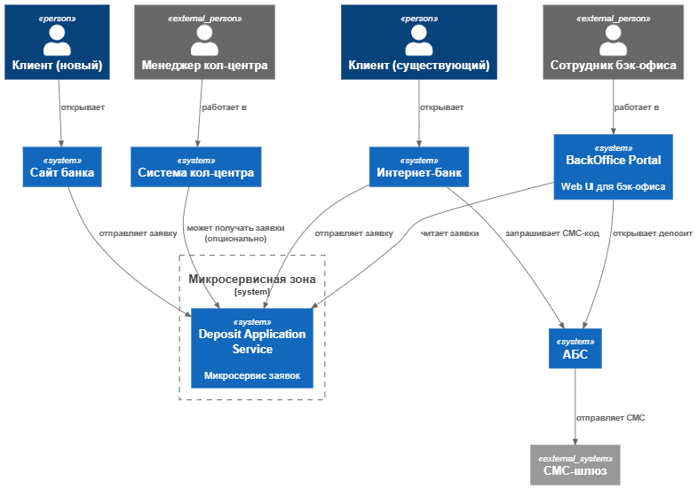
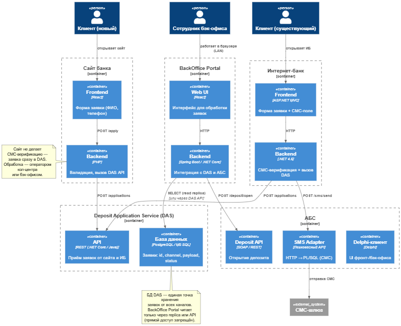

### ``**Название задачи: Открытие депозитов онлайн**

### ``**Автор: Евсюгин Андрей Владимирович**

### ``**Дата: DD.MM.YYYY**

### ``**Функциональные требования**

| **№** | **Действующие лица или системы**                                                                   | **Use Case**                                                                 | **Описание**                                                                                                                                                                                                                                                                                                                                                                                     |
| :----------: | :-------------------------------------------------------------------------------------------------------------------------------- | :--------------------------------------------------------------------------------- | :------------------------------------------------------------------------------------------------------------------------------------------------------------------------------------------------------------------------------------------------------------------------------------------------------------------------------------------------------------------------------------------------------------- |
|      1      | Новый клиент, Сайт,  Система кол-центра,  Менеджер кол-центра      | Подать заявку на депозит через сайт                  | Новый клиент (неавторизованный) вводит ФИО и телефон → заявка сохраняется и передаётся в кол-центр  → менеджер звонит, предлагает условия.                                                                                                                                         |
|      2      | Существующий клиент, Интернет-банк,  АБС,  СМС-шлюз                        | Подать и подтвердить заявку в интернет-банке | Существующий клиент (авторизованный в приложении) выбирает депозит, счёт, сумму → подтверждает СМС-кодом  → заявка ставится в очередь обработки.                                                                                                                             |
|      3      | Менеджер бэк-офиса, АБС                                                                                   | Обработать заявку и открыть депозит                 | Менеджер проверяет заявку, утверждает условия → АБС открывает депозит, отправляет СМС клиенту.                                                                                                                                                                                                                            |
|      4      | Сотрудник бэк-офиса (депозиты/кредиты), Система управления ставками | Управлять ставками по депозитам                        | Редактирование, согласование и публикация ставок в единой системе (не XLS).                                                                                                                                                                                                                                                                         |
|      5      | Новый клиент, Колл-центр,  Бэк-офис депозитов                                       | Создать заявку через КЦ                                        | Колл-центр принимает заявку на депозит (с сайта или звонка). → В АБС создаётся задача для сотрудника бэк-офиса.                                                                                                                                                                                                  |
|      6      | Фронт-офис, АБС,  Новый клиент                                                                   | Подтверждение личности                                        | Сотрудник фронт-офиса проверяет документы и подтверждает личность клиента. → В АБС активируется учётная запись и предоставляется доступ в интернет-банк. → Клиент получает возможность открывать депозиты онлайн. |

### ``**Нефункциональные требования**

Опишите здесь нефункциональные требования и архитектурно значимые требования.

| **№** | **Требование**                                                                                                                            |
| :----------: | :-------------------------------------------------------------------------------------------------------------------------------------------------------- |
|      1      | Доступность сервисов — 99,9% (включая переключение на резервный ЦОД).                                |
|      2      | Время отклика UI (загрузка ставок, отправка заявки) ≤ 500 мс.                                                  |
|      3      | Персональные данные (ФИО, телефон) защищаются с помощью TLS 1.2+.                                           |
|      4      | Новые компоненты масштабируются горизонтально (кроме АБС — только вертикально).       |
|      5      | Запрещено вносить изменения в ядро интернет-банка и АБС.                                                   |
|      6      | Интеграция со СМС — только через асинхронные события (без прямых вызовов PL/SQL извне). |
|      7      | Ставки хранятся в управляемом источнике (БД), а не в XLS.                                                        |

### ``**Решение**

1. **Выделен микросервис Deposit Application Service (DAS)**
   * Принимает заявки **от всех каналов** (сайт, интернет-банк).
   * Имеет **собственную БД** (PostgreSQL / MS SQL — по выбору DevOps).
   * **Не зависит от АБС** в фазе приёма и хранения заявок → повышает отказоустойчивость.
   * Публикует события (например, "Заявка создана") — в будущем — в Kafka, сейчас — в локальную event_log таблицу (для ретроспективного подключения шины).
2. **СМС-верификация выполняется в интернет-банке**
   * Для существующих клиентов: интернет-банк генерирует код, отправляет через **уже существующий СМС-функционал АБС** (вызов через внутренний API-адаптер), проверяет код у себя.
   * Не требует изменений в АБС — только HTTP-обёртку над PL/SQL-пакетом, развёрнутую как отдельный легковесный сервис (dotNet или Java), доступный только из **DMZ**.
3. **Сервис для бэк-офиса (BackOffice Portal)**
   * Отдельное **Web-приложение** , доступное **только в локальной сети банка** (через reverse proxy + LDAP-аутентификация).
   * Читает заявки и обновляет их из DAS через **внутренний REST API** (или напрямую из БД DAS).
   * **Предоставляет удобный интерфейс: фильтры, сортировка, интеграция с АБС (открытие депозита по кнопке).**
4. **Интеграция с АБС**
   * Только **по инициативе бэк-офиса**: при нажатии «Открыть депозит» в BackOffice Portal → вызов **защищённого API АБС** (например, SOAP-сервис, уже существующий для других задач, или новый PL/SQL-пакет с REST-обёрткой).
   * АБС по-прежнему **не вызывается онлайн** из клиентских каналов → требования надёжности соблюдены.

### ``**Альтернативы**

Так как это MVP, то при отсутствии высоких нагрузок можно отказаться от реализации полноценного портала для сотрудников, только доступ к заявкам и изменение статуса, остальные операции можно выполнять по-старому.

**Недостатки, ограничения, риски**

Подробно опишите здесь недостатки, ограничения и риски выбранного решения.

1. На этапе MVP практически нет допюрасходов - используются текущие технологии и отдел разработки. Но при внедрении придётся расширить штат.
2. Текущие бизнес-процесы потребуется сильно формализовать и прописать строгую логику автоматической обработки, когда можно а когда нет выполнять те или иные действия, доп.расход на аналитику и аналитиков.
3. Обучение пользователей работе с новыми программами.
4. Потребуется настройка системы мониторинга сервисов и обновления заявок.
5. Взаимодействие усложнилось, поэтому потребуется end2end тестов.
6. Нужно предусмотреть возможность потерь данных на уровне сети. Если раньше каждый лид можно было отследить по телефонному звонку, то теперь нужно отслеживать лиды с сайта. Если функционал приёма не будет работать, то есть возможность упустить прибыль.
7. (tech) Требуется развернуть **новую БД** и **2 новых сервиса**.
8. (tech) Нужно **согласовать сетевые зоны** (DMZ → LAN для BackOffice Portal).
9. (tech) АБС должна предоставить **2 API-точки** (СМС и открытие депозита) — возможно, потребует минимальных доработок.

[Context](./C4_Context_Deposits_MVP_v2.puml)

[Containers](./C4_Containers_Deposits_MVP_v2.puml)

