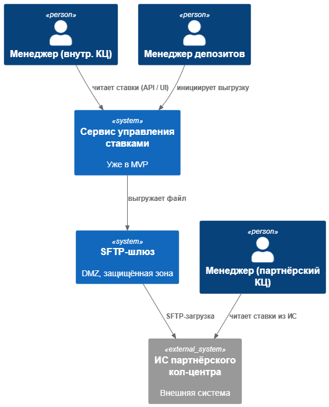
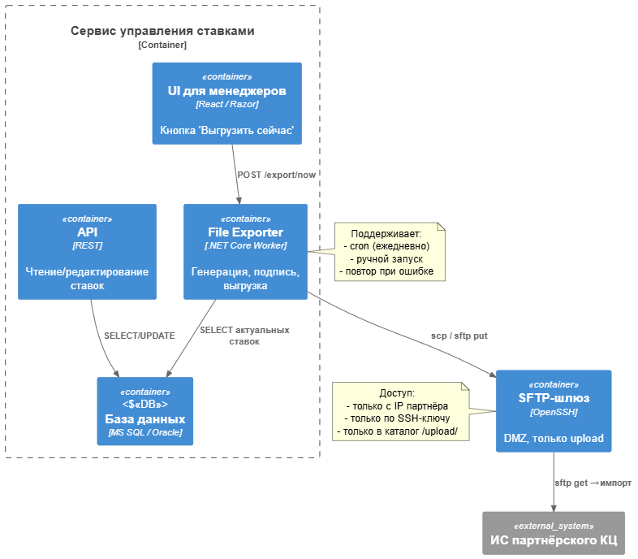

### ``**Название задачи:**

### ``**Автор:**

### ``**Дата:**

### ``**Функциональные требования**

| **№** | **Действующие лица или системы**                                                        | **Use Case**                                                                              | **Описание**                                                                                                                                                                                                                                                                                                                      |
| :----------: | :--------------------------------------------------------------------------------------------------------------------- | :---------------------------------------------------------------------------------------------- | :---------------------------------------------------------------------------------------------------------------------------------------------------------------------------------------------------------------------------------------------------------------------------------------------------------------------------------------------- |
|      1      | пользователь, менеджер КЦ,                                                                  | Пользователь обращается за актуальными ставками | Пользователь запрашивает актуальные ставки в КЦ.                                                                                                                                                                                                                                                      |
|              |                                                                                                                        |                                                                                                 | В задаче 2 мы решили, что нужно обеспечить отображение на сайте актуальных ставок (посредством сервиса) Поэтому сотрудник КЦ банка может получить их на нём,  и озвучить клиенту |
|      2      | пользователь, менеджер партнёрского КЦ, сайт банка                | Пользователь обращается за актуальными ставками | Пользователь запрашивает актуальные ставки в КЦ.                                                                                                                                                                                                                                                      |
|              |                                                                                                                        |                                                                                                 | Сотрудник КЦ считывает данные с сайта банка                                                                                                                                                                                                                                                                |
|      3      | пользователь, менеджер партнёрского КЦ, ИС партнёрского КЦ | Пользователь обращается за актуальными ставками | Пользователь запрашивает актуальные ставки в КЦ.                                                                                                                                                                                                                                                      |
|              |                                                                                                                        |                                                                                                 | Сотрудник КЦ считывает данные из своей ИС                                                                                                                                                                                                                                                                    |
|      4      | сервис ставок по депозитам, ИС партнёрского КЦ                            | ИС партнёрского КЦ считывает ставки                             | ИС партнёрского КЦ обращается по SFTP за актуальными ставками                                                                                                                                                                                                                                 |
|              |                                                                                                                        |                                                                                                 | ИС партнёрского КЦ обновляет их в своей ситеме                                                                                                                                                                                                                                                          |

### ``**Нефункциональные требования**

| **№** | **Требование**                                                                                                                                                                                                |
| :----------: | :---------------------------------------------------------------------------------------------------------------------------------------------------------------------------------------------------------------------------- |
|      1      | Обмен данными возможен только через файлы (CSV/JSON/XML)                                                                                                                                  |
|      2      | Передача файлов должна быть по защищеным каналам связи (SFTP + IP whitelist)                                                                                                   |
|      3      | В колл-центре должна быть возможность получить наиболее актуальные ставки                                                                                     |
|      4      | Актуальность данных у партнёра —**≤ 24 часов** (при штатной выгрузке) или **≤ 15 минут** (по требованию).                                |
|      5      | Если сервис выходит из строя. то менеджер депозитного отдела должен иметь возможность вручную обновить файл со ставками |
|      6      | Должна быть возможность обновить ставки по требованию (вне расписания)                                                                                            |

### ``**Решение**

Использовать сервис ставок из task2 для чтения данных online (на сайте должна быть метка времени актуальности данных)

Или с использованием SFTP

1. Передача файлов осуществляется по протоколу SFTP из-за его безопасности и надежности.
2. Колл-центр получает доступ к актуальным ставкам во время обращения пользователя, что улучшает качество обслуживания.
3. Данные о ставках передаются по расписанию и обновляются в файлах на файловом сервере с доступом по SFTP, что обеспечивает надежность и устойчивость к сбоям или "по требованию".

### ``**Альтернативы**

Ручная выгрузка файлв в шлюз без использования сервиса - для партнёрского КЦ подойдёт.

Так как менеджер контролирует выгрузку каждый день, то прописать в должностных обязанностях обновить файл для SFTP и получить подтверждение, что ИС партнёра обновила данные.

Так как ставки - публичная информация, то разместить файлы в облачных хранилищах, тогда не нужно SFTP, а использовать авторизацию облачного сервиса.

Почта для менеджера с контрольным звонком.

[Контекст](./C4_Context_Stakes_Export.puml)

[Контейнер](./C4_Containers_Stakes_Export.puml)

**Недостатки, ограничения, риски**

Риск при автоматическом обновлении - неактуальные данные в партнёрском КЦ, в зависимости от частоты выгрузок.
Отказ SFTP шлюза.
Проблемы с фаерволом или политикой безопасности в ИС пратнёрского КЦ
