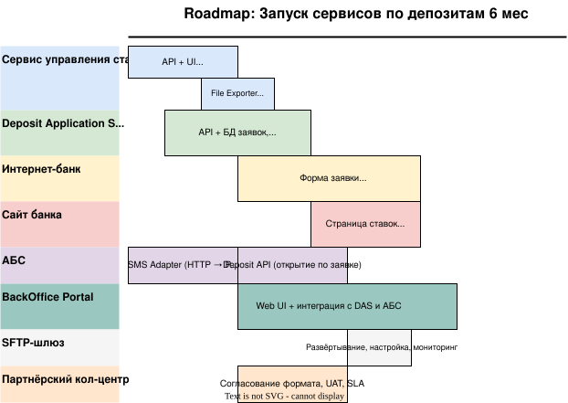

# RoadMap

| № | Система / Компонент                | Крупная задача                                                         | Длительность, мес (v1) |
| -- | -------------------------------------------------- | ----------------------------------------------------------------------------------- | ------------------------------------- |
| 1  | Сервис управления ставками | Разработка API + UI управления ставками                 | 1.5                                   |
| 2  | Сервис управления ставками | File Exporter + SFTP-интеграция                                           | 1.0                                   |
| 3  | Deposit Application Service (DAS)                  | API + БД заявок, интеграция со ставками                 | 2.0                                   |
| 4  | Интернет-банк                          | Форма заявки + СМС-верификация + вызов DAS            | 2.5                                   |
| 5  | Сайт банка                                | Страница ставок + форма заявки (новые клиенты) | 1.5                                   |
| 6  | АБС                                             | SMS Adapter (HTTP → PL/SQL)                                                        | 1.0                                   |
| 7  | АБС                                             | Deposit API (открытие по заявке)                                    | 1.0                                   |
| 8  | АБС                                             | Read-only view ставок (если хранение в АБС)                   | 0.5                                   |
| 9  | BackOffice Portal                                  | Web UI + интеграция с DAS и АБС                                      | 2.5                                   |
| 10 | SFTP-шлюз                                      | Развёртывание, настройка, мониторинг                | 0.5                                   |
| 11 | Партнёрский кол-центр           | Согласование формата, UAT, SLA                                   | 1.0                                   |

[roadmap](./roadmap.drawio)

